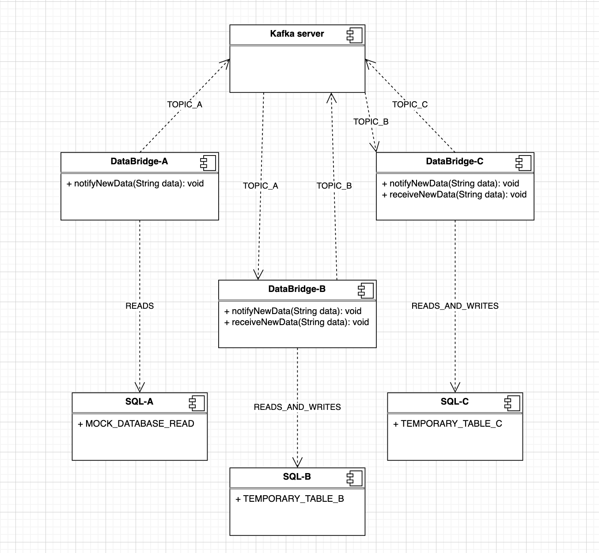

# 🚀 KafkaDataBridge

KafkaDataBridge is a lightweight **data integration bridge** built on top of **Apache Kafka**.  
It enables seamless message flow between systems, acting as a producer, consumer, or transformation layer.

---

### System Architecture



---

## ✨ Features

- 📡 Easy Kafka producer/consumer configuration  
- 🔗 Acts as a message bridge between data sources  
- 🐳 Docker-ready configuration  
- 🐳 Production-ready docker composition demo
- ⚙️ Customizable topics and message routing  
- 🔍 Clear modular structure for further expansion  

---

## 📦 Requirements

- Java 21+  
- Apache Kafka (local or remote broker)  
- Maven 3+  
- Docker (optional)  

---

## ⚙️ Installation

```bash
git clone https://github.com/mbogudal/KafkaDataBridge.git
cd KafkaDataBridge
mvn clean compile package
docker build -t kafkadatabridge:latest .  
docker up --build
